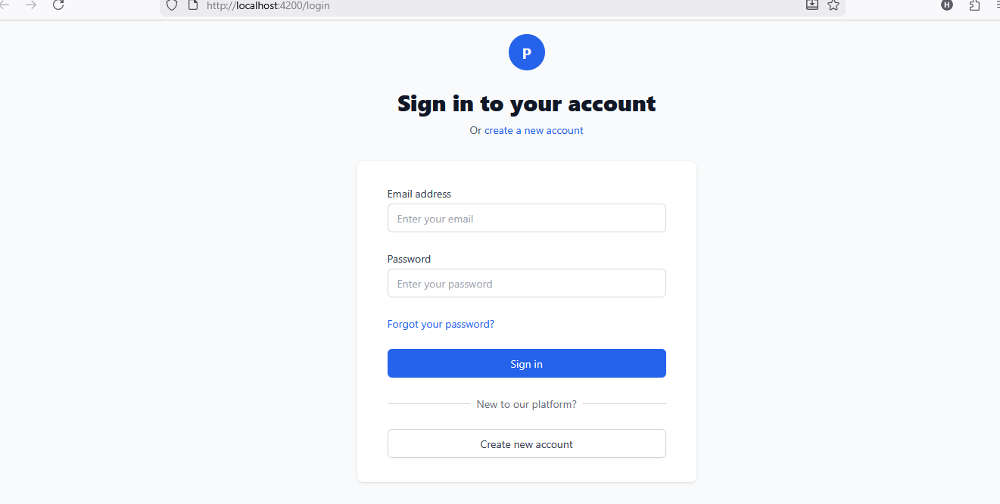
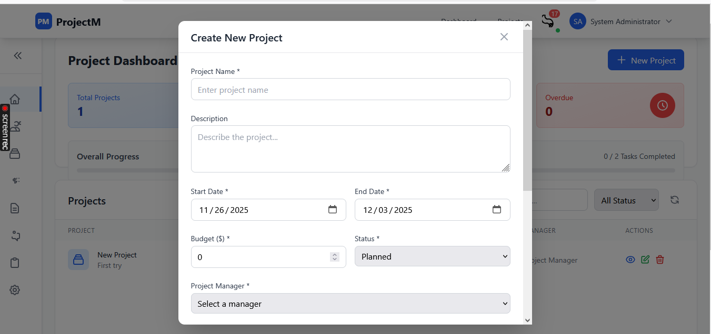
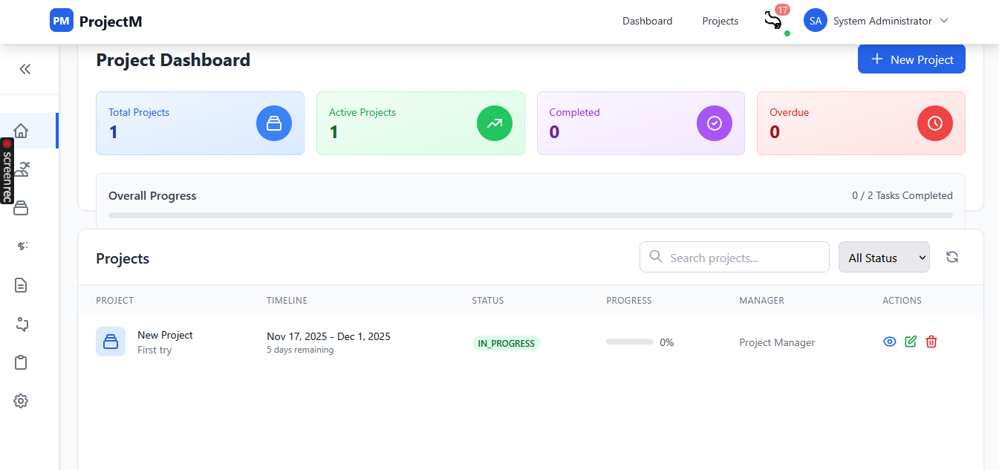
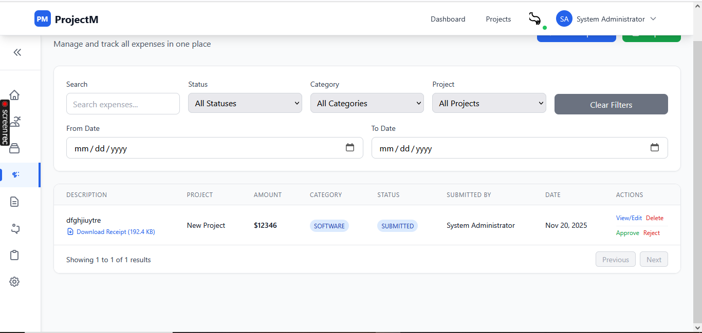
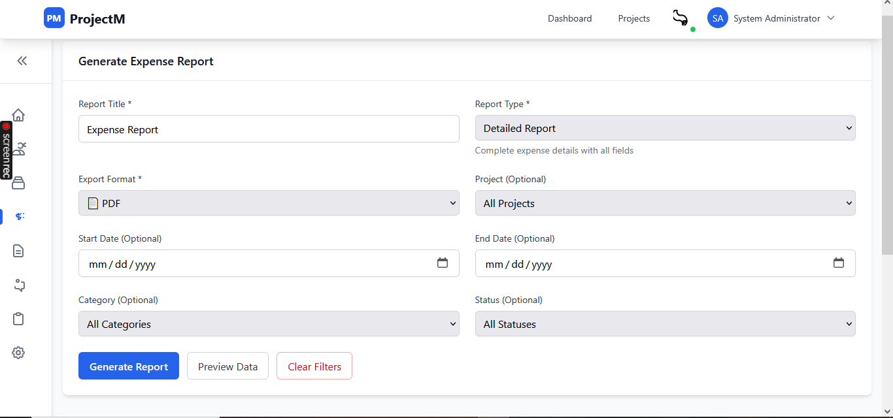
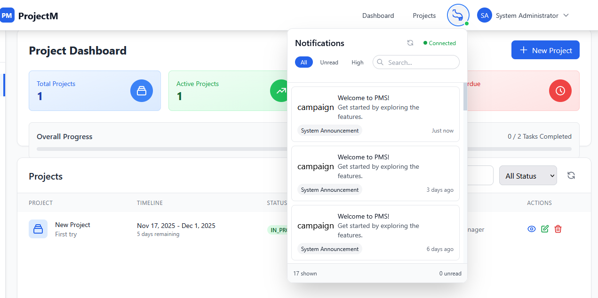
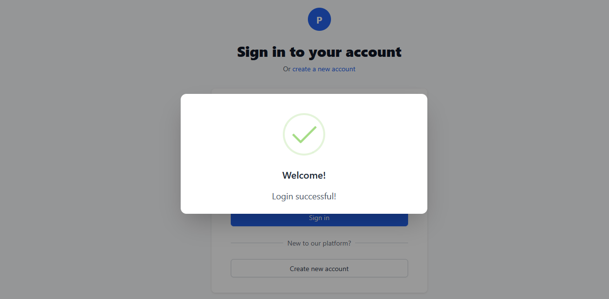
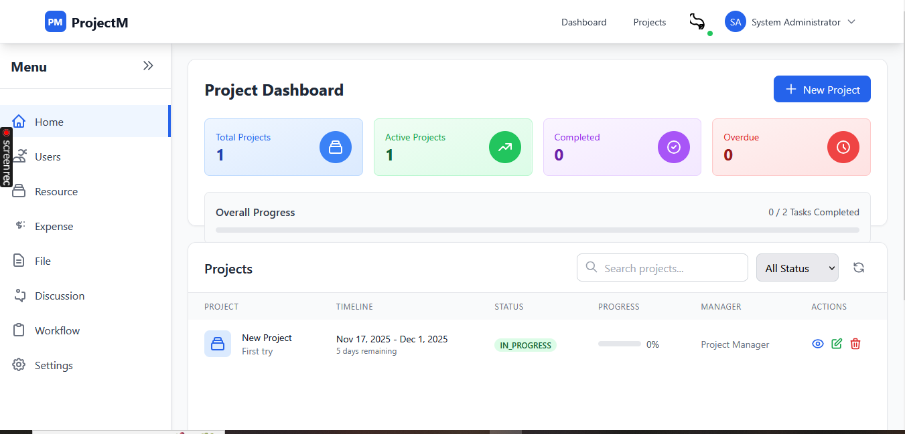

# Project Management System (PMS)

A full-stack web application developed with Spring Boot backend and Angular 15 frontend, featuring comprehensive project management capabilities with real-time collaboration.
## Features

### Core Modules
- **Project Tracking** - Complete project lifecycle management
- **Kanban Board** - Interactive drag-drop functionality for task management
- **Task Management** - Create, assign, and track tasks with deadlines
- **Resource Allocation** - Efficient team and resource management
- **File Management** - Document sharing and version control
- **Expense Tracking** - Budget management and expense monitoring
- **Team Management** - Team creation and member allocation
- **Real-time Collaboration** - Discussions and notifications

### Technical Features
- **JWT Authentication** - Secure user authentication and authorization
- **Real-time Notifications** - WebSocket-based live updates
- **RESTful APIs** - Comprehensive API documentation with Swagger
- **Responsive Design** - Mobile-friendly interface with Tailwind CSS

## Application Screenshots

### Authentication

### Project Management

### Team Management

### Resource Management

### File & Financial Management

### Collaboration & UI

## Tech Stack

### Frontend
- **Angular 15** - Frontend framework
- **Tailwind CSS** - Utility-first CSS framework
- **TypeScript** - Programming language
- **WebSocket** - Real-time communication

### Backend
- **Spring Boot** - Java-based backend framework
- **MySQL** - Relational database
- **JWT** - JSON Web Token authentication
- **Spring Security** - Security framework
- **WebSocket** - STOMP messaging protocol

## Prerequisites

Before running this application, ensure you have installed:
- Java 17 or higher
- Node.js 16 or higher
- Angular CLI 15
- MySQL 8.0 or higher
- Maven 3.6 or higher
